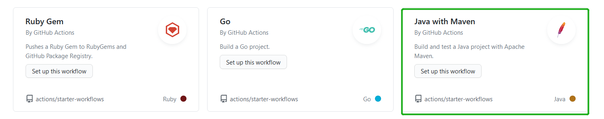
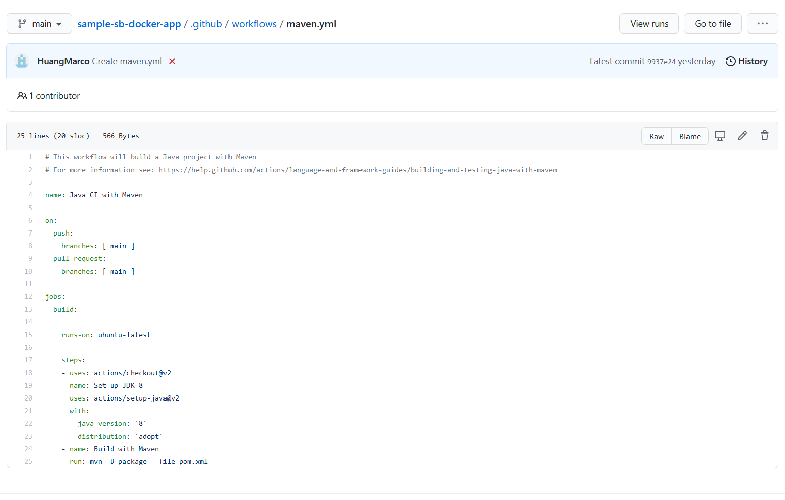
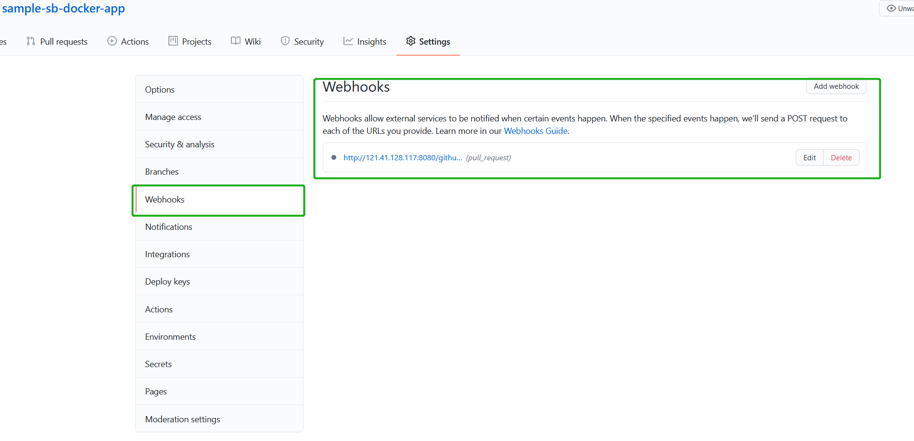

# 建立Jenkins Integration Test

## 旧版-使用TravisCI

当一个新的pull request被发起的时候，希望执行代码测试，测试提交的代码是否ok，此时可以选择TravisCI，也可以选择Github Action

- TravisCI对于github open source public repo是免费的，但是如果github repo是私有的，那么只能build 100次，因为有这样的限制，所以就不考虑它了。果断迁移到了Github Action
- 另外如果github repo集成TravisCI，可以选择指定哪个repo install github apps，而不需要在全局github/settings/apps中安装github app
- 初期使用的是[Travis](https://travis-ci.com/account/repositories)来做Github 的CI，关于Travis的配置，本例中使用的是Github直接与Travis CI互联，更多关于使用Travis，查看其官网，以及`ext/Using TravisCI xxx.pdf`
- 已创建的[TravisCI](https://travis-ci.com/account/repositories),使用HuangMarco账户登录

## 使用Git hub Action 配置integration test

先阅读[GitHub Actions 快速入门](https://docs.github.com/cn/actions/quickstart)

在阅读[GitHub Actions 简介](https://docs.github.com/cn/actions/learn-github-actions/introduction-to-github-actions)

参考[从 Travis CI 迁移到 GitHub Actions](https://docs.github.com/cn/actions/learn-github-actions/migrating-from-travis-ci-to-github-actions)

### 选择模板

- 本例中是以SB应用作为docker image的对象，所以很自然project是一个sb
- integration test的目标是测试sb应用是否能够正常编译打包，所以选择java for maven
- jdk版本为8,关于 [Building and testing Java with Maven](https://docs.github.com/en/actions/guides/building-and-testing-java-with-maven)，关于[action中支持的jdk版本](https://github.com/actions/setup-java)

[sample-sb-docker-app](https://github.com/HuangMarco/sample-sb-docker-app)作为负责创建docker image的app

选择好模板之后，发现在根目录多出.github/workflow目录

根据需求编辑yaml

注意.github/workflow是可以clone到本地然后编辑的。

### 更新应用

因为是sb应用，所以要初始化package，同时注意：

- 如果是将应用打包成docker image，需要添加Dockerfile
- 同时对于sb应用，可以追加maven plugin for dockerfile，同时注意与上面的maven.yaml适配，这样github action使用maven对项目进行build
- github action/maven.yaml中的JDK版本，必须要与pom.yml中的相同

## 样例 - 完整Github Repo到Jenkins

### 配置Git Project integration test

[github action workflox语法](https://docs.github.com/en/actions/reference/workflow-syntax-for-github-actions)
[Building and testing Java with Maven](https://docs.github.com/en/actions/guides/building-and-testing-java-with-maven)

上述Github Action的配置是没有问题的：

- 当main branch有提交的时候，执行integration test
- 当发起的PR针对于main分支的时候，执行integration test，对当前branch的代码进行编译，具体动作在于shell command的编写
- 当PR被approved，执行merge request动作之后，代码进入到main分支之后，在main分支上再次对项目进行编译，确保编译没有问题，编译完成之后，到Jenkins持续到下一流程，例如，build docker image。
    当然在这步骤中也可以在Github Action中不执行该步骤动作，转而将main分支编译动作交给Jenkins，jenkins编译完成之后，再继续通过管道流转到下一步。

比如上述的[配置on-push语法](https://docs.github.com/en/actions/reference/workflow-syntax-for-github-actions#example-using-a-single-event)

本样例中：

- 本样例中正常对于非main分支的push操作，不会引发github action
- 设计Github Action只负责PR时的branch build, 可以编辑workflow配置文件，根据[github action workflox语法](https://docs.github.com/en/actions/reference/workflow-syntax-for-github-actions)
- PR部分通过webhook交给Jenkins管道进行编译

### 配置Git Project Webhook 连接Jenkins

为该Github Repo添加集成Jenkins的webhook，每当PR被approved之后，代码进入到main分支，触发Jenkins hook，拉取main分支代码，然后构建docker image。

#### 延伸-配备Jenkins

本来该部分内容应该放在外部jenkins/ReadMe.md中的，但是因为本篇文档主要叙述integration test，所以为了不脱节连贯起来，所以在此对integration test进行延伸。

- integration-test部分的job已经交给Github Action，有了github webhook之后，理论上来说，push/pr也都可以交给jenkins来完成。在这里的设计：发起pr的时候，触发github action, 对当前branch代码进行编译。所以PR之后代码进入到main分支时，触发push to main操作。该操作trigger Jenkins hook
- 一个project对应Jenkins中的一项新的task

Jenkins的考量：

- Jenkins应当属于CD即Continuos Delivery持续交付的一部分，定位上不要定位于CI-Continuos Integration
- [流水线](https://www.jenkins.io/zh/doc/book/pipeline/getting-started/)是一套插件，它支持实现和集成持续交付流水线到 Jenkins。
    此时需要考虑的是：何时需要交付？比如一个sb应用build完成之后，需要打包成docker image，那么应当在哪里将docker image push到repository中？该动作应当在jenkins中完成，拉取git repo并完成build docker image并push的过程
- 整个CI/CD的流程是需要进行设计的，项目往往超出一个，需要在多个项目之间进行流转

#### Jenkins New Item

Dashboard >> New Item

Jenkins Job命名规范：

`<primary purpose of the job | uppercase>_<(GitHub) project name>_<branch name / additional info>`

所以通常Jenkins命名规范遵照如下：

BUILD_my-project
DEPLOY_my-project_staging
TEST_my-project_staging
UTILITY_install-helpful-tool_staging
INFRA_run-job-dsl

## 拓展

[Installing GitHub Apps](https://docs.github.com/en/developers/apps/managing-github-apps/installing-github-apps)
[从 Travis CI 迁移到 GitHub Actions](https://docs.github.com/cn/actions/learn-github-actions/migrating-from-travis-ci-to-github-actions)
[Setting up continuous integration using workflow templates](https://docs.github.com/en/actions/guides/setting-up-continuous-integration-using-workflow-templates)
[非必须CI-applitools](https://applitools.com/blog/applitools-eyes-github-integration-how-to-visually-test-every-pull-request/)
[github-bot-usr-github-pull-request-plugin-jenkins](https://github.com/jenkinsci/ghprb-plugin/blob/master/README.md)
